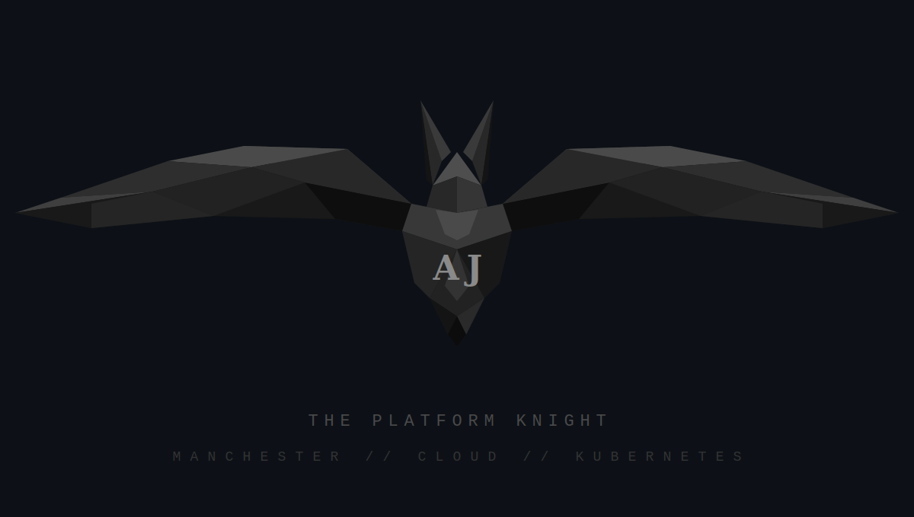

<div align="center">

<!-- CUSTOM AJ × BAT LOGO — host this PNG in your profile repo -->


<br/>

<!-- TYPING SVG — MYSTERIOUS -->
<a href="https://git.io/typing-svg"></a>

<br/><br/>

<!-- STALKER COUNTER -->


</div>

---

<div align="center">

```
 ╔═══════════════════════════════════════════════════════════════╗
 ║                                                               ║
 ║   "It's not who I am underneath,                              ║
 ║    but what I deploy that defines me."                        ║
 ║                                                               ║
 ╚═══════════════════════════════════════════════════════════════╝
```

</div>

---

### 🦇 `signal_received` — Who is this?

```yaml
alias: "AJ"
location: "Manchester, UK 🇬🇧"
role: "Platform Engineer"
clearance_level: "██████████"

# What I do (declassified)
specialization:
  - "Cloud infrastructure & migrations"
  - "Internal Developer Platforms"
  - "Kubernetes everything"
  - "GitOps as a religion, not a practice"

# What I actually do (classified)
redacted: "████████████████████████████"
```

---

### 🛠️ Utility Belt

<div align="center">

<br/>


<br/>

</div>

---

### 🦇 The Batcave Principles

<div align="center">

```
   ┌──────────────────────────────────────────────────┐
   │                                                    │
   │   01  If it's not in Git, it doesn't exist.       │
   │   02  If Flux can't reconcile it, neither can I.  │
   │   03  Automate until you forget how to do it.     │
   │   04  Every decision gets an ADR. Every. One.     │
   │   05  The cluster is always right.                │
   │                                                    │
   └──────────────────────────────────────────────────┘
```

</div>

---

### 📡 Surveillance Feed

<div align="center">


</div>

<br/>

<div align="center">

</div>

---

### 🐍 Contribution Grid Elimination Protocol

<div align="center">

<picture>
  <source media="(prefers-color-scheme: dark)" srcset="https://raw.githubusercontent.com/anuragjanghala/anuragjanghala/output/github-snake-dark.svg" />
  <source media="(prefers-color-scheme: light)" srcset="https://raw.githubusercontent.com/anuragjanghala/anuragjanghala/output/github-snake.svg" />
  
</picture>

</div>

> *⚙️ Requires [snk action](https://github.com/Platane/snk) setup in your profile repo*

---

### 🗂️ Classified Files

<details>
<summary>📂 <code>open_file: origin_story.txt</code></summary>
<br/>

```
> Platform Engineer based in Manchester.
> Started from tinkering with servers, ended up
> orchestrating containers at scale.
>
> I build the platforms that other engineers
> build their products on. The infrastructure
> behind the infrastructure. The shadow layer.
>
> When I'm not in the terminal, I'm probably
> learning drums — R&B and hip-hop grooves.
> Still a beginner. Still committed.
>
> The signal is strong. The uptime is eternal.
```

</details>

<details>
<summary>📂 <code>open_file: current_missions.txt</code></summary>
<br/>

```
STATUS: ACTIVE

MISSION 01 ─── Cloud Migrations
  └── Moving tenants between worlds. Silently.

MISSION 02 ─── Internal Developer Platforms
  └── Making infra invisible to the people who use it.

MISSION 03 ─── Side Project [CLASSIFIED]
  └── AI × Infrastructure. Lean stack. Big ambition.
  └── Details: ████████████████

MISSION 04 ─── Skill Acquisition
  └── Drums 🥁 | System Design | Always learning.
```

</details>

<details>
<summary>📂 <code>open_file: tech_philosophy.md</code></summary>
<br/>

```markdown
# How I Think About Infrastructure

1. GitOps isn't a tool. It's a contract.
2. If your platform needs a manual, it's broken.
3. Cost-consciousness isn't cheap — it's engineering.
4. The best migration is the one nobody notices.
5. ADRs are love letters to your future self.
```

</details>

<details>
<summary>📂 <code>open_file: music_log.dat</code></summary>
<br/>

```
🥁 DRUM PRACTICE LOG
═══════════════════════
Genre:    R&B / Hip-Hop / Pop
Level:    Beginner (but consistent)

Current Focus:
  ├── Pocket timing
  ├── Ghost notes
  └── Not rushing fills

"My reconciliation loops are tighter
 than my timing. Working on both."
```

</details>

---

### 📡 Signal the Batcave

<div align="center">

[](https://linkedin.com/in/anuragjanghala)
[](mailto:janghalaanurag@gmail.com)

</div>

---

<div align="center">


<sub>

```
The night is darkest just before deployment.
```

</sub>

</div>
